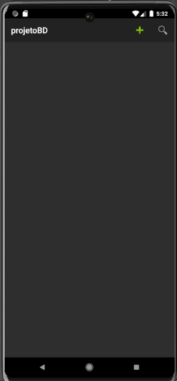
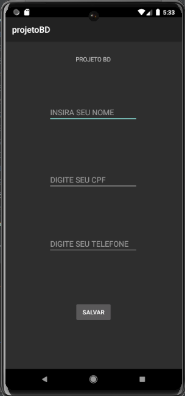
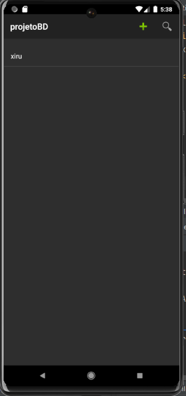

## projetoBD

### SOBRE O PROJETO
- Esse projeto foi pensando para treinar os comandos de mobile, sendo ultilizado com a turma do técnico do CSL.

### LAYOUT DAS TELAS
### Tela 1
- Tela inicial do projeito, aonde é possivel olhar os usuários cadastrados,fazer pesquisas por tals e cadastrar novos.

### Tela 2
- Tela de cadastro onde é possivel cadastrar novos usuário no BD, após de salvar clique para voltar para tela anterior.

### Tela 3
- Tela mostrando como fica a visibilidade dos dados do usuário após cadastrados.

### Tela 4
- Tela mostrando como funciona a pesquisa de usuário.

### TECNOLOGIAS ULTILIZADAS
- Android Studios

### BACKEND
- Java(mobile)

### FRONTEND
- XML(Activity)

### IDE
- Android Studios

### APK DO PROJETO
https://drive.google.com/file/d/1WRAz44zRxEW6TGTSP5NLTNDvTiuwlTm2/view?usp=sharing

### COMO INSTALAR
- 1° Acesse o link
  
- 2° Acesse o arquivo do link

- 3° Clique em instalar
Após isso so testar

### PRÉ REQUISITOS
- Android 8.0

## CRÉDITOS
Feito por Felipe Sampaio  | 
https://github.com/felipeCsampaio LINK DO PROFILE DE FELIPE SAMPAIO
